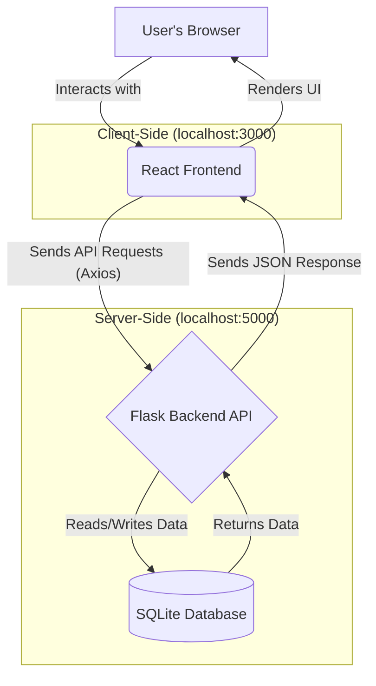

# Finwiz: AI-Powered Personal Finance Dashboard

Welcome to Finwiz, a comprehensive, full-stack personal finance application designed to empower users with intelligent tools for tracking expenses, managing goals, and planning for the future. This application provides a clean, intuitive interface for visualizing financial data and leverages a Python backend for data processing, user management, and AI-powered predictions.

---

## ✨ Core Features

Finwiz is packed with features to provide a complete personal finance management experience:

* **Secure User Authentication:** Full signup and login functionality with password hashing to ensure user data is secure. Each user's financial data is completely private.
* **Dynamic Dashboard:** An at-a-glance overview of the user's financial health, including recent transactions, goal progress, and a dynamic expense chart.
* **Full Transaction Management (CRUD):**
    * **Create:** Add new income or expense transactions through a user-friendly modal.
    * **Read:** View a complete, paginated history of all transactions.
    * **Delete:** Easily remove incorrect or unwanted transactions.
* **Goal Management (CRUD):**
    * **Create:** Set new financial goals with a name and a target amount.
    * **Read:** View all goals and their current progress on the dashboard and a dedicated goals page.
    * **Delete:** Remove goals that are no longer relevant.
* **AI-Powered Expense Prediction:** The dashboard features a smart widget that analyzes a user's past spending habits to predict their expenses for the upcoming month, broken down by category.
* **Interactive Investment Predictor:** A powerful calculator that projects the growth of an investment over time based on initial amount, monthly contributions, and estimated annual interest rate, visualized with a dynamic line chart.
* **UPI QR Code Scanner:** Quickly add expenses by scanning real-world UPI QR codes. The scanner intelligently parses the recipient's name and the transaction amount to pre-fill the expense form, making data entry fast and seamless.

---

## 🛠️ Tech Stack & Architecture

This project is a full-stack application leveraging modern technologies for a robust and scalable solution.

| Area       | Technology   | Description                                                                    |
| :--------- | :----------- | :----------------------------------------------------------------------------- |
| **Frontend** | React.js     | A powerful JavaScript library for building dynamic and responsive user interfaces. |
|            | Axios        | For making clean, promise-based HTTP requests to the backend API.              |
|            | Recharts     | A declarative charting library for creating beautiful and interactive data visualizations. |
|            | HTML5-QRCode | A library for integrating camera-based QR code scanning functionality.         |
| **Backend** | Python       | A versatile and powerful language for server-side logic and data processing.   |
|            | Flask        | A lightweight and flexible web framework for building the REST API.            |
|            | Pandas       | Used in our AI engine for efficient data manipulation and analysis.            |
| **Database** | SQLite       | A self-contained, serverless SQL database engine perfect for rapid development. |

### 📊 Application Flow Chart

The application follows a standard client-server architecture. The React frontend communicates with the Flask backend via a REST API, and the backend interacts with the SQLite database to store and retrieve user data.



---

## 🚀 Getting Started

To get a local copy up and running, follow these simple steps.

### Prerequisites

* Node.js and npm (for the React frontend)
* Python and pip (for the Flask backend)

### Installation & Setup

1.  **Clone the repository:**
    ```sh
    git clone [https://github.com/your-username/Finwiz.git](https://github.com/your-username/Finwiz.git)
    cd Finwiz
    ```

2.  **Setup the Backend (Server):**
    * Navigate to the `server` directory.
        ```sh
        cd server
        ```
    * Create and activate a Python virtual environment.
        ```sh
        # On Windows
        python -m venv venv
        .\venv\Scripts\activate

        # On macOS/Linux
        python3 -m venv venv
        source venv/bin/activate
        ```
    * Install the required Python packages.
        ```sh
        pip install -r requirements.txt
        ```
    * Initialize the database. **(Run this command only once!)**
        ```sh
        python init_db.py
        ```
    * Run the Flask server.
        ```sh
        flask run
        ```
    * Your backend will now be running at `http://127.0.0.1:5000`.

3.  **Setup the Frontend (Client):**
    * Open a **new terminal** and navigate to the `client` directory.
        ```sh
        cd client
        ```
    * Install the required npm packages.
        ```sh
        npm install
        ```
    * Run the React development server.
        ```sh
        npm start
        ```
    * Your frontend will now be running. Open your browser and go to `http://localhost:3000`.

### Default User Credentials

You can log in with the default user created during database initialization:
* **Email:** `test@example.com`
* **Password:** `password123`

You can also sign up with a new account to start with a blank slate.

---

## 🌐 API Endpoints

The Flask server exposes the following REST API endpoints:

| Endpoint                  | Method   | Description                                                      |
| :------------------------ | :------- | :--------------------------------------------------------------- |
| `/api/signup`               | `POST`   | Creates a new user account.                                      |
| `/api/login`                | `POST`   | Logs in a user and returns their user ID.                        |
| `/api/transactions`         | `GET`    | Fetches all transactions for a given `userId`.                   |
| `/api/transactions`         | `POST`   | Adds a new transaction for a given `userId`.                     |
| `/api/transactions/<id>`    | `DELETE` | Deletes a specific transaction by its ID.                        |
| `/api/goals`                | `GET`    | Fetches all goals for a given `userId`.                          |
| `/api/goals`                | `POST`   | Adds a new goal for a given `userId`.                            |
| `/api/goals/<id>`           | `DELETE` | Deletes a specific goal by its ID.                               |
| `/api/expense-chart-data`   | `GET`    | Calculates and returns dynamic expense chart data for a user.    |
| `/api/predict-expenses`     | `GET`    | Predicts a user's future expenses based on their history.        |
| `/api/predict-investment`   | `POST`   | Calculates and returns an investment growth projection.          |
